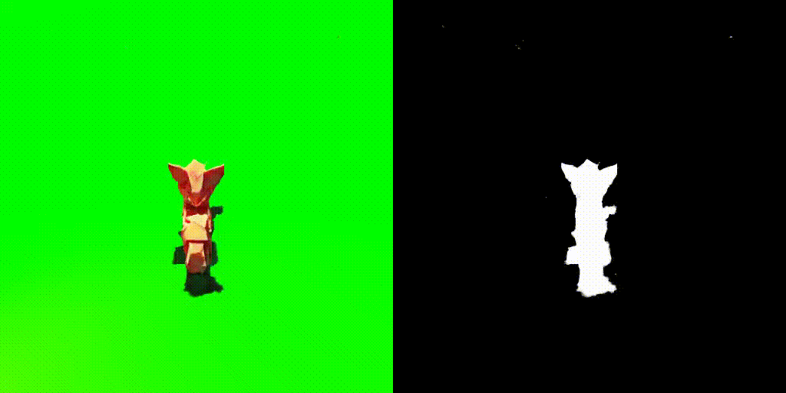
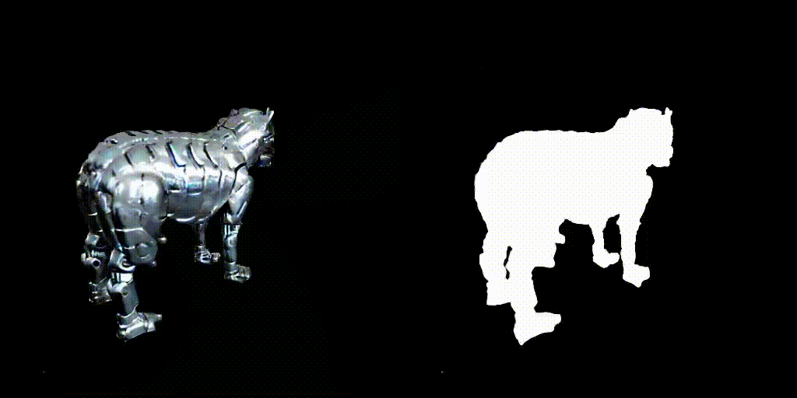

# 3DFuse - threestudio

<a href="https://arxiv.org/abs/2303.07937"></a>
<a href="https://ku-cvlab.github.io/3DFuse/"></a>
<br>

<p align="center">






</p>
This is an threestudio extension of the paper "Let 2D Diffusion Model Know 3D-Consistency for Robust Text-to-3D Generation". 

To use it, please install [threestudio](https://github.com/threestudio-project/threestudio) first and then install this extension in threestudio `custom` directory. 

- **This code is forked from [threestudio](https://github.com/threestudio-project/threestudio) for VSD backbone version of 3DFuse.**
- **For SJC backbone version of 3DFuse, check original [3DFuse](https://github.com/KU-CVLAB/3DFuse/tree/main) repo.**


## Introduction
<center>
 
</center>

We introduce 3DFuse, a novel framework that incorporates 3D awareness into pretrained 2D diffusion models, enhancing the robustness and 3D consistency of score distillation-based methods. For more details, please visit our [project page](https://ku-cvlab.github.io/3DFuse/)!


## Installation
3DFuse - threestudio is extension of threestudio. Before clone this repository, clone and install threestudio first.
### Install threestudio environment
**This part is the same as original threestudio. Skip it if you already have installed the environment.**

❗️CAUTION: YOU DON'T NEED TO CLONE THREESTUDIO REPOSITORY!! THIS PART IS ONLY FOR ENVIRONMENT SETTING.❗️

See [installation.md](docs/installation.md) for additional information, including installation via Docker.

-  You must have an NVIDIA graphics card with at least 20GB VRAM and have [CUDA](https://developer.nvidia.com/cuda-downloads) installed.
-  Install `Python >= 3.8`.
- (Optional, Recommended) Create a virtual environment:

```sh
python3 -m virtualenv venv
. venv/bin/activate

# Newer pip versions, e.g. pip-23.x, can be much faster than old versions, e.g. pip-20.x.
# For instance, it caches the wheels of git packages to avoid unnecessarily rebuilding them later.
python3 -m pip install --upgrade pip
```

Install `PyTorch >= 1.12`. We have tested on `torch1.12.1+cu113` and `torch2.0.0+cu118`, but other versions should also work fine.

```sh
# torch1.12.1+cu113
pip install torch==1.12.1+cu113 torchvision==0.13.1+cu113 --extra-index-url https://download.pytorch.org/whl/cu113
# or torch2.0.0+cu118
pip install torch torchvision --index-url https://download.pytorch.org/whl/cu118
```

- (Optional, Recommended) Install ninja to speed up the compilation of CUDA extensions:

```sh
pip install ninja
```

- Install dependencies:

```sh
pip install -r requirements.txt
```

### Install 3DFuse
After installing threestudio, install 3DFuse extension by:

```sh
git clone https://ku-cvlab.github.io/3DFuse-threestudio/

cd 3DFuse/RASTER
pip install -e .
```

## Quickstart
```sh
python launch.py --config custom/3DFuse-threestudio/configs/prolificdreamer-fuse.yaml  --train --gpu 0 system.prompt_processor.prompt="a product photo of a toy tank" system.image_dir="YOUR_IMAGE"
```

## Acknowledgement
This code is built on the [threestudio-project](https://github.com/threestudio-project/threestudio). Thanks to the maintainers for their contribution to the community! Also, we would like to acknowledge the contributions of public projects, including [SJC](https://github.com/pals-ttic/sjc/) and [ControlNet](https://github.com/lllyasviel/ControlNet) whose code has been utilized in this repository.

## Citation
```
@article{seo2023let,
  title={Let 2D Diffusion Model Know 3D-Consistency for Robust Text-to-3D Generation},
  author={Seo, Junyoung and Jang, Wooseok and Kwak, Min-Seop and Kim, Hyeonsu and Ko, Jaehoon and Kim, Junho and Kim, Jin-Hwa and Lee, Jiyoung and Kim, Seungryong},
  journal={arXiv preprint arXiv:2303.07937},
  year={2023}
}
```
